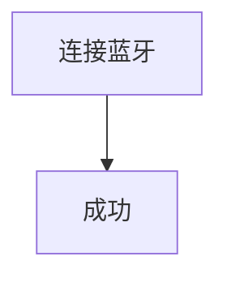

#### BLE

##### 微信小程序BLE低功耗蓝牙基础操作封装，基于promise，操作简单，包含蓝牙通信整套流程。

项目地址： https://github.com/arsize/ble.git

#### 项目背景
该项目是为了简化微信小程序环境下的蓝牙接入流程，经过线上正式项目长达一年的运行，发现许多坑，而且难以移植，所以将它封装出来提高可维护性以及可移植性，这里提供了一个试运行Demo，可以根据具体需求继续定制化。

#### 流程图

#### 使用介绍
pass

#### 效果展示
pass

#### 常见问题
pass
